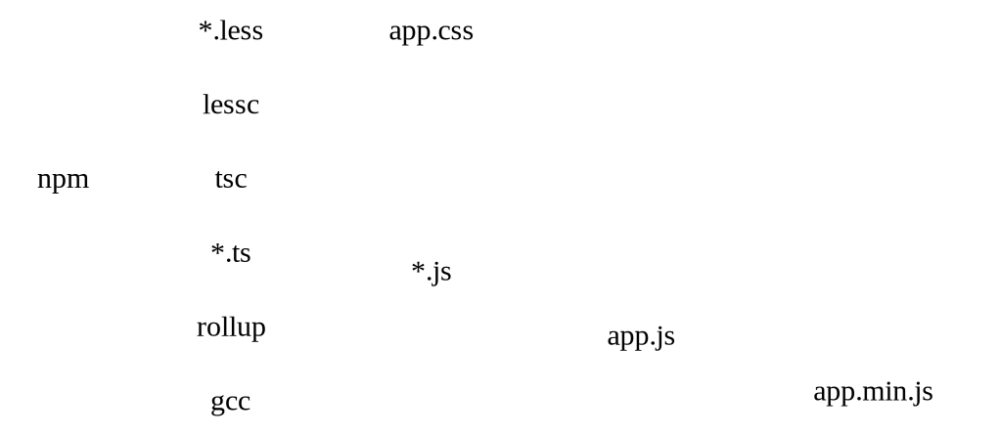

# es6+

ES6+/TS skeleton code

  - [rollup](https://rollupjs.org/) for bundling
    - [rollup-plugin-includepaths](https://github.com/dot-build/rollup-plugin-includepaths) for dot-less imports
  - [google closure compiler](https://developers.google.com/closure/compiler) for minification and transpilation
  - [less](https://github.com/less/less.js) for css
  - [tsc](https://www.typescriptlang.org/docs) for typescript
  - make-based build
  - inotify for watching

## Usage

Install and build:

```
make
```

Production-ready version:

```
make min
```

Clean up:

```
make clean
```

Watch:

```
make watch
```

## Graph


